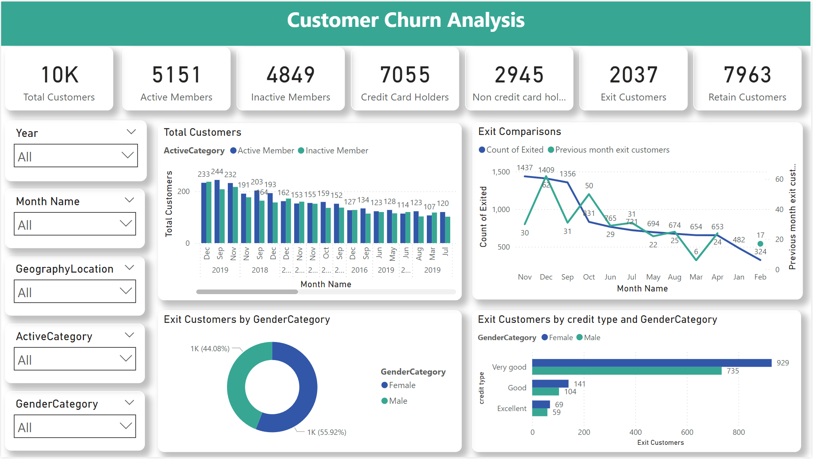

# 🔄 Customer Churn Analysis Dashboard

[](https://opensource.org/licenses/MIT)
[](https://powerbi.microsoft.com/)
[](Datasets/Bank_Churn.csv)
[]()
[]()
[](https://github.com/pouryare)

A comprehensive Power BI dashboard analyzing customer churn patterns in banking sector. This interactive visualization tool provides insights into customer retention, credit card usage, and demographic factors affecting customer exits.



## 📋 Table of Contents
- [Overview](#overview)
- [Key Features](#key-features)
- [Dashboard Components](#dashboard-components)
- [Dataset Description](#dataset-description)
- [Technical Implementation](#technical-implementation)
- [Installation](#installation)
- [File Structure](#file-structure)
- [Key Insights](#key-insights)
- [License](#license)

## 🎯 Overview

The Customer Churn Analysis Dashboard transforms complex customer data into actionable insights through detailed visualization of churn patterns, customer demographics, credit scores, and banking product usage. It enables data-driven decision-making for customer retention strategies and risk assessment.

## ✨ Key Features

- 📊 Customer Exit Analysis
- 💳 Credit Card Usage Tracking
- 👥 Demographic Insights
- 📈 Time Series Analysis
- 💰 Credit Score Categorization
- 📅 Monthly Trend Analysis
- 🌍 Geographic Distribution

## 📊 Dashboard Components

### 1. Key Metrics Cards
- Total Customers (10K)
- Active Members (5,151)
- Inactive Members (4,849)
- Credit Card Holders (7,055)
- Exit Customers (2,037)
- Retain Customers (7,963)

### 2. Customer Activity Analysis
- Monthly customer counts
- Active vs. Inactive member trends
- Year-over-year comparison

### 3. Exit Analysis
- Monthly exit comparisons
- Previous month trends
- Gender-based exit patterns

### 4. Credit Score Analysis
- Credit type distribution
- Exit patterns by credit score
- Gender-based credit analysis

## 📚 Dataset Description

The dataset includes comprehensive banking records with the following key variables:

### Key Features
- 💰 Credit Score
- 👤 Demographics (Gender, Geography)
- 📅 Bank Tenure
- 💳 Product Usage
- 💵 Balance Information

### Tables
1. Bank_Churn.csv (Main fact table)
2. CustomerInfo.csv
3. Dimension tables.xlsx
   - Gender categories
   - Geography lookup
   - Activity status
   - Credit card status

## 🔧 Technical Implementation

### Data Model Features
1. Fact-Dimension Schema
2. Time Intelligence Functions
3. DAX Measures
4. Custom Credit Scoring
5. Data Category Mapping

### Key DAX Measures
- Exit Customer Calculation
- Active Member Metrics
- Credit Type Classification
- Time-based Comparisons

## 📥 Installation

```bash
# Clone this repository
git clone https://github.com/pouryare/Customer-Churn-Analysis.git
cd Customer-Churn-Analysis

# Open the .pbix file
# Connect to your data source
# Refresh the dashboard
```

## 📁 File Structure

```
📦 Customer-Churn-Analysis
 ┣ 📂 Datasets
 ┃ ┣ 📄 Bank_Churn.csv
 ┃ ┣ 📄 CustomerInfo.csv
 ┃ ┗ 📄 dimension tables.xlsx
 ┣ 📜 .gitattributes
 ┣ 📜 customer churn analysis.pbix
 ┣ 📜 LICENSE
 ┣ 📜 README.md
 ┗ 📷 screenshot.png
```

## 🔍 Key Insights

1. **Customer Distribution**
   - Total customer base of 10,000
   - Nearly equal split between active (5,151) and inactive (4,849) members
   - High credit card adoption rate (7,055 holders)

2. **Exit Patterns**
   - Higher exit rates among female customers (55.92% vs 44.08%)
   - Credit score correlation with churn
   - Monthly exit trends showing seasonal patterns

3. **Credit Profile Analysis**
   - Excellent credit score customers show lowest churn
   - Very good credit category shows highest retention
   - Gender-specific credit patterns emerging

4. **Retention Metrics**
   - 79.63% customer retention rate
   - Clear correlation between credit score and loyalty
   - Geographic variations in retention patterns

## 📄 License

This project is licensed under the MIT License - see the [LICENSE](LICENSE) file for details.

Made with ❤️ by [Pourya](https://github.com/pouryare)

[](https://github.com/pouryare)